# Image and Audio Signal Processing Project With MATLAB

MATLAB coursework project for Signals and Systems. The project applies core signals-and-systems concepts — convolution, the Fourier transform, filtering, and amplitude modulation — to real image and audio data. It contains seven MATLAB exercises split into two parts:

**Image Processing** (reading and inspecting RGB/grayscale images, pixel-level statistics and probability, histogram analysis, image arithmetic, downsampling and 2×2 pooling, edge detection via 2D convolution, and denoising)

**Audio Processing & AM Communication** (time- and frequency-domain analysis, echo via an impulse response, AM modulation/demodulation at two carrier frequencies, adding/removing white Gaussian noise with a Butterworth low-pass filter, and signal recovery). 

Each script is self-contained, runnable, commented in Turkish (as required by the course), and produces the figures and console output documented in the accompanying report. Running the scripts requires MATLAB (developed/tested on R2023b or later) with the Image Processing Toolbox (`rgb2gray`, `imnoise`, `imgaussfilt`, `imhist`, `imwrite`, `imfinfo`), the Signal Processing Toolbox (`butter`, `filter`, `awgn`, `conv`, `conv2`, `fft`), and audio I/O support (`audioread`, `audiowrite`, `sound`).

## Part 1 — Image Processing (Questions 1–6)

### Q1 — Reading and Displaying the Color Image

Original color image used throughout this part:

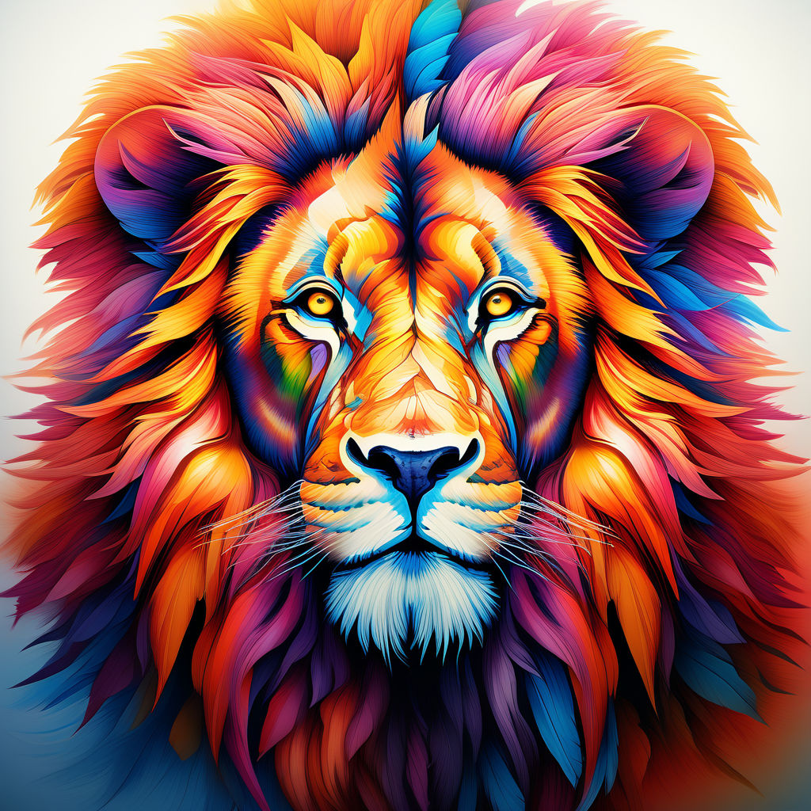

A color image is 3-dimensional (x, y, color), where the color axis holds the red, green, and blue (RGB) intensity values.

**a)** The image was opened in MATLAB, and its width and height in pixels were found.

**b)** The RGB values of the pixel at position (371, 371) were found.

**c)** The image was displayed as a figure.

### Q2 — Grayscale Conversion, Histogram, and Region Recoloring

A grayscale image is 2-dimensional (x, y); each pixel holds a single intensity value between black and white.

**a)** The color image was converted to grayscale and displayed as a figure.

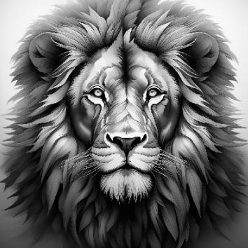

**b)** The value of the pixel at position (371, 371) was found.

**c)** The histogram of the grayscale image was plotted (x-axis: pixel intensity, y-axis: count).

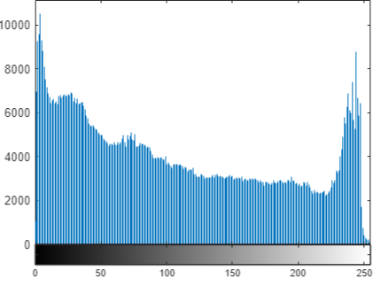

**d)** The probability that a randomly chosen pixel has an intensity greater than 131 was found.

**e)** The image was recolored using two thresholds (92 and 171): pixels ≤ 92 were colored black, 92 < pixels ≤ 171 were colored red, and pixels > 171 were colored yellow. The result was displayed as a figure.

**f)** The region between pixels 200 and 824 (both width and height) of the recolored image was displayed as a separate figure.

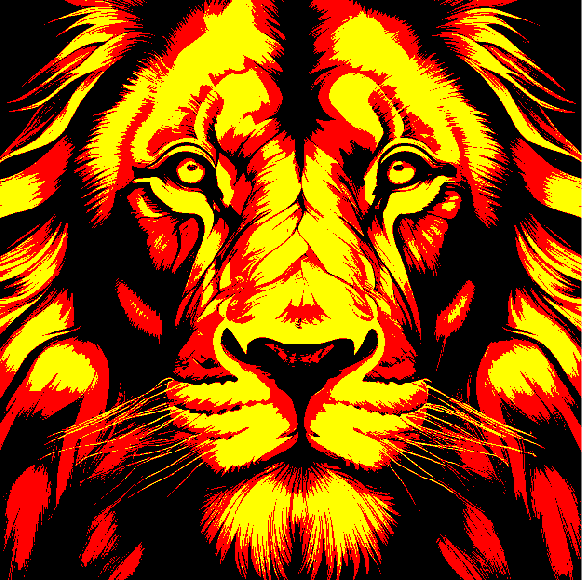

### Q3 — Channel Averages, Mean Subtraction, and Image Inversion

**a)** The average color (R, G, B) value across all pixels of the color image was found.

**b)** These average values were subtracted from every pixel, and the new image was displayed as a figure.

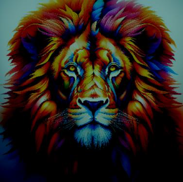

**c)** The inverse of the image — the color values that complement the original values to 255 (i.e. 255 minus each pixel value) — was computed and displayed as a figure.

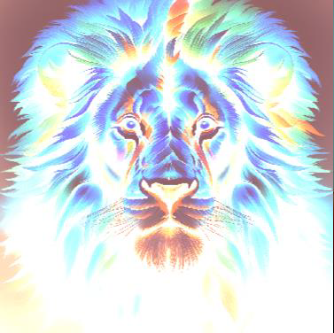

**d)** The inverted image was added to the original image, and the result was displayed as a figure. As expected, this produced an image in which all color values reached 255, which appeared as plain white when displayed.

### Q4 — Downsampling and 2×2 Pooling

This question implements various downsampling methods to compress the image while trying to preserve as much quality as possible.

**a)** The size of the original color image was found in kilobytes.

**b)** The even-indexed rows and columns were removed and the remaining pixels were merged; the new image was saved, and its size was found.

**c)** Only every 4th row and column were kept, with the rest dropped; the new image was saved, and its size was found. The three images (original, b, c) were displayed side by side in one figure.

**d)** 2×2 max pooling, min pooling, and average pooling were applied, each reducing the image to a quarter of its size, and the three results were displayed together with the original in a 2×2 layout, along with their file sizes.

Max pooled lion image

Min pooled lion image

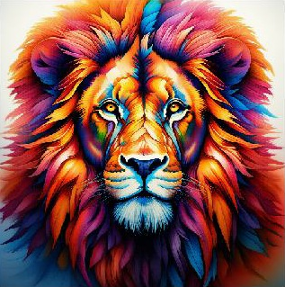

Average pooled lion image

**e)** Image quality and file size were compared across the three methods, and the preferred method was explained.

### Q5 — Edge Detection via Convolution

Original color image used throughout this part:

The following 1×2 impulse response is applied to an image (convolution) to detect edges in it.

**a)** The city image was opened in MATLAB and converted to grayscale. Its convolution with the 1×2 impulse response matrix h[i,j] = [0.02, -0.02] was taken. The new image was displayed alongside the original in a single figure, and the results were interpreted.

Grey-toned city image

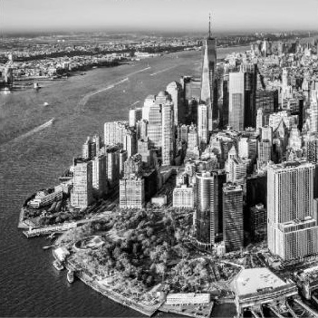

Convolved city image

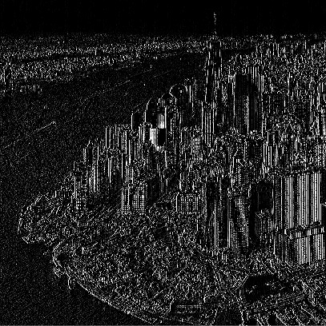

### Q6 — Noise and Denoising

This question adds noise to the image and then filters it out.

**a)** Gaussian noise with variances 0.1, 0.4, and 0.7 was added to the color image using imnoise. The original image was displayed together with the three noisy versions in a single figure.

0.1 variance Gaussian noise added lion image

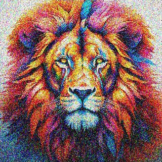

0.4 variance Gaussian noise added lion image

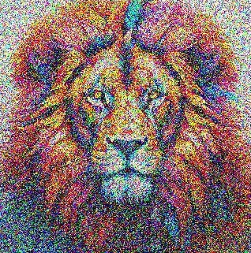

0.7 variance Gaussian noise added lion image

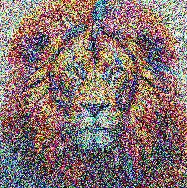

**b)** A Gaussian filter (imgaussfilt) was applied to the 0.1-variance noisy image. The original, noisy, and filtered images were displayed and compared side by side in one figure.

## Part 2 — Audio Processing & AM Communication (Question 7)

This part analyzes an audio signal in the time and frequency domains, adds echo, adds and removes noise, and performs the modulation/demodulation stages of AM communication.

### a) The guitar audio was opened and listened to in MATLAB. The sampling frequency, number of samples, and duration were found. The signal was plotted over time.

Amplitude-time graph of guitar audio

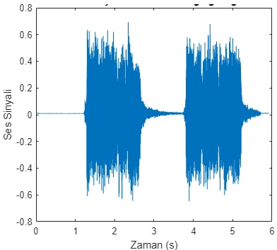

### b) The Fourier transform of the audio signal was taken, and its frequency spectrum was plotted and interpreted.

Amplitude-frequency graph of guitar audio

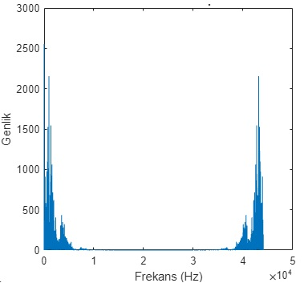

### c) An impulse response that adds echo to the sound was found, producing an output containing the original signal, an echo at 1/4 the original amplitude after 1 second, and another echo at 1/16 the original amplitude after 2 seconds (y[n] = x[n] + x[n-1]/4 + x[n-2]/16). The impulse response was applied via convolution, and the output was saved and listened to. Its duration was found and compared with the original signal, and its time-domain and frequency-spectrum graphs were plotted and compared with the original.

Echo added amplitude-time graph of guitar audio

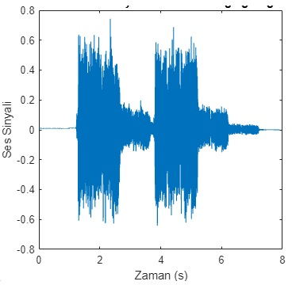

Echo added amplitude-frequency graph of guitar audio

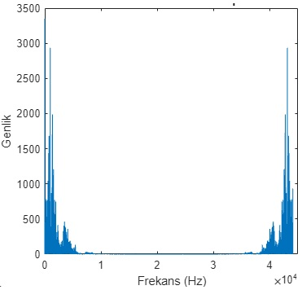

### d) The echoed signal was multiplied by cos(2πfc·t) using fc = 1 kHz and fc = 10 MHz, producing two modulated signals. Both were listened to and compared.

### e) The time-domain and frequency-spectrum graphs of the signal modulated with the fc = 10 MHz carrier were plotted and interpreted.

Modulated amplitude-time graph of guitar audio

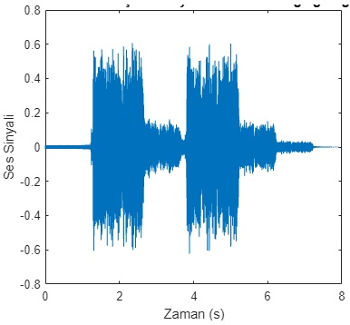

Modulated amplitude-frequency graph of guitar audio

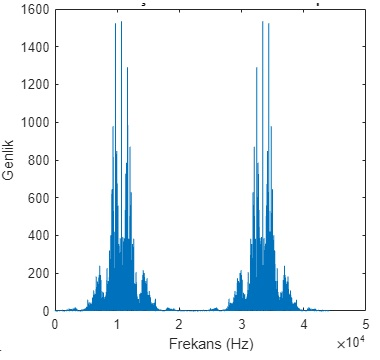

### f) This signal was multiplied again by cos(2πfc·t) (fc = 10 MHz), and its frequency spectrum was inspected. It was then passed through a low-pass filter to demodulate it, and its frequency spectrum was inspected again.

Demodulated amplitude-frequency graph of guitar audio

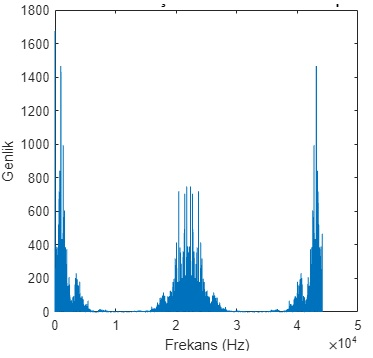

Filtered demodulated amplitude-frequency graph of guitar audio

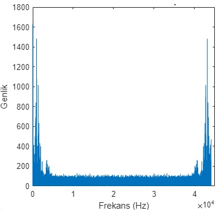

### g) Random noise (White Gaussian Noise) was added to the signal. The noisy audio was listened to and confirmed to be audibly noisy, and its frequency spectrum was plotted.

Noisy amplitude-time graph of guitar audio

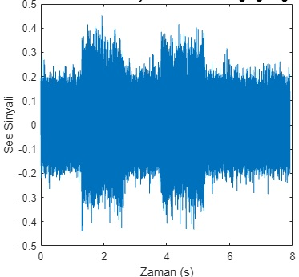

### h) The noise was filtered out, and the resulting spectrum was compared with the echoed signal's spectrum.

Filtered noisy amplitude-frequency graph of guitar audio

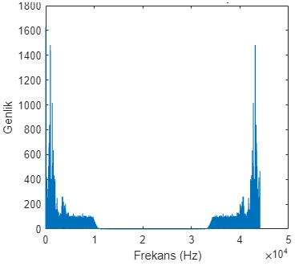

### i) Using the impulse response from part (c), the original signal was recovered. This audio was saved and listened to, and its frequency spectrum was plotted and compared with the first recording.